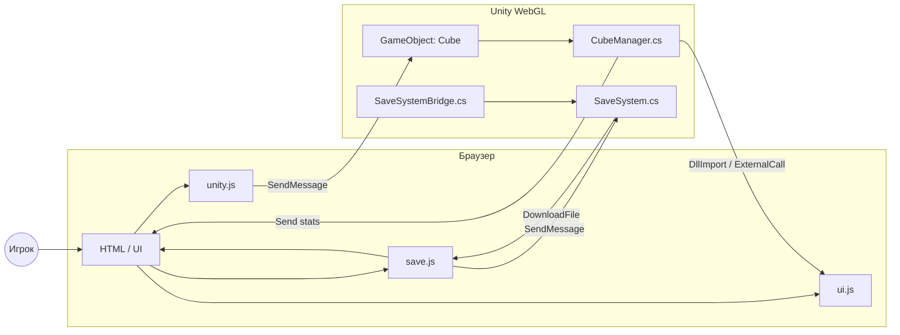
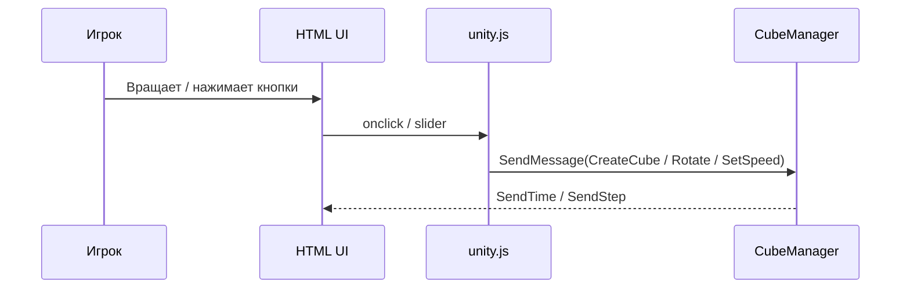
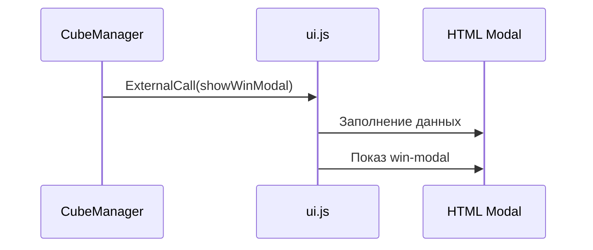
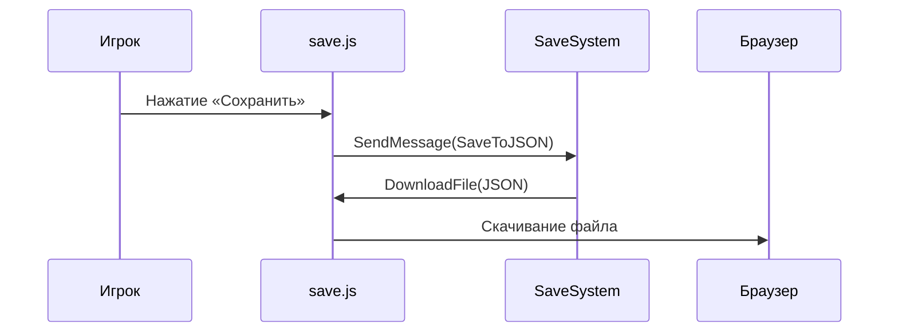
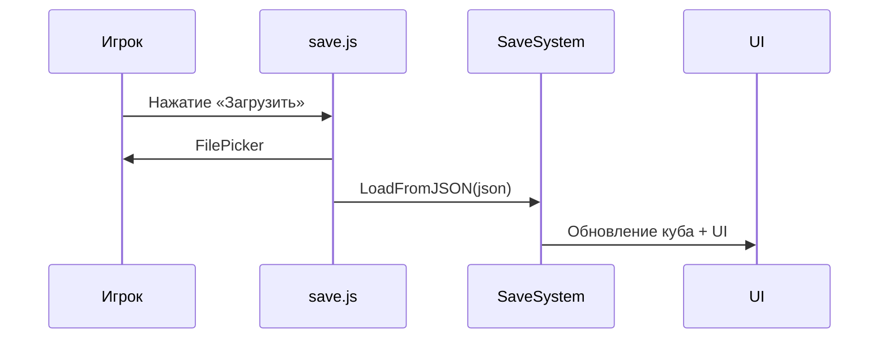

# Unity ↔ WebGL интеграция

Этот документ — **человеко‑читаемая и расширяемая документация** по связке Unity (C#) и HTML/JS.
Формат сделан так, чтобы ты мог **легко дописывать, копировать блоки и масштабировать проект**.

---

## 🧩 1. Переменные (C# / Unity)

### 📦 CameraMovement
| Переменная | Тип | Доступ | Назначение |
|---|---|---|---|
| localRotation | Vector3 | private | Накопленный поворот камеры |
| mouseStartPos / mouseEndPos | Vector3 | private | Позиции для вычисления свайпа |
| cameraDisabled | bool | private | Блокировка камеры |
| rotateDisabled | bool | private | Блокировка вращения куба |
| CubeMan | CubeManager | public | Ссылка на менеджер куба |
| pieces / planes | List<GameObject> | private | Выбранные части и их плоскости |

---

### 📦 CubeManager
| Переменная | Тип | Доступ | Назначение |
|---|---|---|---|
| CubePrefab | GameObject | public | Префаб части кубика |
| cubeRoot | Transform | private | Родитель всех частей |
| allPieces | List<GameObject> | public | Все 27 частей |
| rotationSpeed | float | [SerializeField] public | Скорость вращения (JS ↔ Unity) |
| step | int | [SerializeField] public | Счётчик шагов |
| min / sec | int | [SerializeField] public | Таймер |
| _elapsedTime | float | [SerializeField] public | База таймера |
| _style | string | [SerializeField] public | Текущий стиль |
| saveSystem | SaveSystem | public | Система сохранений |

---

### 📦 SaveSystem / Data
| Класс | Поле | Тип | Назначение |
|---|---|---|---|
| CubeSaveData | cubelets | List<CubeletData> | Все 27 кубиков |
| CubeSaveData | step/min/sec | int | Статистика |
| CubeSaveData | rotationSpeed | float | Скорость |
| CubeletData | px/py/pz | float | Позиция |
| CubeletData | rx/ry/rz/rw | float | Кватернион |

---

## ⚙️ 2. Методы Unity (C#)

### 🧠 CubeManager — публичный API
| Метод | Сигнатура | Назначение |
|---|---|---|
| CreateCube | void(string) | Создание нового куба |
| ShuffleCube | IEnumerator | Перемешивание |
| SolveCube | void | Авто‑решение |
| WebGL_SetSpeed | void(float) | Установка скорости из JS |
| CheckSolved | void | Проверка победы |
| ShowWinModal | void | Unity → JS (победа) |

---

### 💾 SaveSystem
| Метод | Сигнатура | Назначение |
|---|---|---|
| SaveToJSON | void | Сохранение состояния |
| LoadFromJSON | void(string) | Загрузка из строки |
| ApplySaveData | void(CubeSaveData) | Применение сохранения |

---

## 🌐 3. HTML / JS — точки интеграции

### 🆔 DOM id
| id | Роль | Кто управляет |
|---|---|---|
| TimeM / TimeS | Таймер | Unity → JS |
| Step | Шаги | Unity → JS |
| Speed | Скорость | Unity ↔ JS |
| speed-slider | Слайдер | JS → Unity |
| solve-button | Решение | JS → Unity |
| save-button | Сохранить | JS → Unity |
| load-button | Загрузить | JS → Unity |
| win-modal | Победа | JS (ui.js) |

---

## 🔁 4. Взаимодействия

### Unity → JS
| Источник | Как | Результат |
|---|---|---|
| DllImport | DOM | Обновление UI |
| ExternalCall | showWinModal() | Открытие победы |

### JS → Unity
| Файл | SendMessage | Метод |
|---|---|---|
| unity.js | Cube | CreateCube / SolveCube |
| unity.js | Cube | WebGL_SetSpeed |
| save.js | SaveSystem | SaveToJSON / LoadFromJSON |

---

## 🛠 5. Шаблоны для расширения

### ➕ Добавить новую кнопку
```html
<button id="new-action">Action</button>
```
```js
document.getElementById('new-action').onclick = () => {
  unityInstance.SendMessage('Cube','NewMethod');
}
```

### ➕ Добавить новое поле в сохранение
```csharp
public float newValue;
```

---

## ✅ Примечания
- В `SaveSystem.jslib` вызывается `OnFileLoaded`, которого **нет в C#**
- Рекомендуется либо добавить метод, либо заменить на `LoadFromJSON`

---

📌 **Документ живой** — копируй секции, добавляй классы и методы без ограничений.

---

## 🔷 6. Диаграмма взаимодействий (Unity ↔ WebGL)

Ниже — **единая схема того, как данные и события ходят между Unity, HTML и JavaScript**.
Диаграмма написана в формате **Mermaid**, ты можешь:
- вставлять её в README.md
- использовать в GitHub / GitLab Wiki
- расширять без ограничений

### 📊 Общая схема



---

### 🔁 Поток: обычная игра



---

### 🏆 Поток: победа



---

### 💾 Поток: сохранение



---

### 📂 Поток: загрузка



---

## 🧠 Как расширять диаграмму

### ➕ Добавить новый JS-файл
```mermaid
JS_NEW[ai.js]
JS_NEW -->|SendMessage| CubeManager
```

### ➕ Добавить новый GameObject
```mermaid
NewGO[GameObject: Analytics]
JS_SAVE -->|SendMessage| NewGO
```

---

## ✅ Рекомендации
- **JS → Unity**: только через `SendMessage`
- **Unity → JS**: `DllImport` или `ExternalCall`
- UI-логика **не должна** быть в Unity

---

📐 Диаграмма отражает текущую архитектуру и служит основой для масштабирования проекта.

